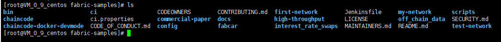
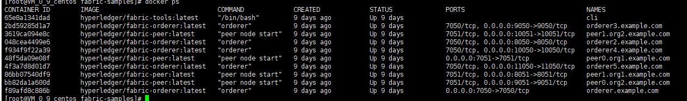

Hyperledger Fabric网络体验
=========================================
### 先决条件
在我们开始之前，如果您还没有这样做，您可能希望检查是否在要开发区块链应用程序和/或运行Hyperledger Fabric的平台上安装了以下所有前提条件。这里采用的是CentOS 7.6

```
[root@VM_0_9_centos ~]#  cat /etc/redhat-release
CentOS Linux release 7.6.1810 (Core)
```

#### 安装Git
如果尚未安装最新版本的git，或者如果您在运行curl命令时遇到问题，请下载它。

>yum install -y git

#### 安装cURL
如果尚未安装cURL工具的最新版本，或者从文档中运行curl命令时遇到错误，请下载它。

>yum install -y curl

#### 安装wget

>yum install -y wget

#### Docker和Docker Compose

您将需要在Hyperledger Fabric上进行操作或进行开发的平台上安装以下组件：

- MacOSX，* nix或Windows 10：Docker需要 Docker 17.06.2-ce或更高版本。
- Windows的旧版本：Docker Toolbox-同样，需要Docker版本Docker 17.06.2-ce或更高。

通过执行docker --version 查看版本

```
[root@VM_0_9_centos ~]# docker version
Client: Docker Engine - Community
 Version:           19.03.5
 API version:       1.40
 Go version:        go1.12.12
 Git commit:        633a0ea
 Built:             Wed Nov 13 07:25:41 2019
 OS/Arch:           linux/amd64
 Experimental:      false

Server: Docker Engine - Community
 Engine:
  Version:          19.03.5
  API version:      1.40 (minimum version 1.12)
  Go version:       go1.12.12
  Git commit:       633a0ea
  Built:            Wed Nov 13 07:24:18 2019
  OS/Arch:          linux/amd64
  Experimental:     false
 containerd:
  Version:          1.2.10
  GitCommit:        b34a5c8af56e510852c35414db4c1f4fa6172339
 runc:
  Version:          1.0.0-rc8+dev
  GitCommit:        3e425f80a8c931f88e6d94a8c831b9d5aa481657
 docker-init:
  Version:          0.18.0
  GitCommit:        fec3683
  ```
### Fabric网络体验
#### 1、下载 Fabric samples

首先将fabric-samples clone到本地


```bash
git clone https://github.com/hyperledger/fabric-samples

```


<div align=center>



</div>

#### 2、生成秘钥及相关交易信息
cd到fabric-samples/first-network目录下，运行

```bash
./byfn.sh  generate

```


该命令是用于生成fabric网络中的组件秘钥信息以及初始的交易信息。包括：ordering服务和节点的秘钥信息(msp和tls的证书)，ordering服务的创世块，管道配置交易信息(channel.tx)，和锚点的更新交易信息。

命令运行完成后，可以看到first-network下的crypto-config 和channel-artifacts文件夹下都新生成了一些文件。Channel-artifacts下是新生成的创世块和管道交易信息，以及锚点更新交易信息。Crypto-config里则是ordering 服务和节点相关的秘钥信息。

#### 3、启动网络

```bash
./byfn.sh up

```

该命令启动了一个默认设置的网络，这些默认的设置包括：

- channel名字为myChannel

- cli的timeout时间为10s

- 延迟为3s

- 使用的docker-compose-file为docker-compose-cli.yaml

- 数据库类型为goleveldb

- 语言为go语言

- 使用最新的镜像启动网络

完整的命令如下：

```bash
./byfn.sh up –c myChannel –t 10 –d 3 –f docker-compose-cli.yaml –s goleveldb –l go –i latest
```

#### 4、启动的流程为：

1)、创建四个节点

2)、创建了一个ordering服务

3)、创建了一个cli服务，为了下面可以使用 docker exec -it bash 进入到各个容器内。

4)、创建一个channel
  ```
 peer channel create -o orderer.example.com:7050 -c mychannel -f ./channel-artifacts/channel.tx --tls true --cafile /opt/gopath/src/github.com/hyperledger/fabric/peer/crypto/ordererOrganizations/example.com/orderers/orderer.example.com/msp/tlscacerts/tlsca.example.com-cert.pem
   ```


5)、分别把四个节点加入到这个channel中
  ```
peer channel join -b mychannel.block
  ```
 6)、之后更新这些加入到myChannel的节点所属的ordering服务已经msp信息
  ```
peer channel update -o orderer.example.com:7050 -c mychannel -f ./channel-artifacts/Org2MSPanchors.tx --tls true --cafile /opt/gopath/src/github.com/hyperledger/fabric/peer/crypto/ordererOrganizations/example.com/orderers/orderer.example.com/msp/tlscacerts/tlsca.example.com-cert.pem
   ```


7)、安装默认的chaincode到peer0.org2节点上
  ```
peer chaincode install -n mycc -v 1.0 -l golang -p github.com/chaincode/chaincode_example02/go/
   ```


8)、实例化chaincode

 ```
peer chaincode instantiate -o orderer.example.com:7050 --tls true --cafile /opt/gopath/src/github.com/hyperledger/fabric/peer/crypto/ordererOrganizations/example.com/orderers/orderer.example.com/msp/tlscacerts/tlsca.example.com-cert.pem -C mychannel -n mycc -l golang -v 1.0 -c '{"Args":["init","a","100","b","200"]}' -P 'OR    ('\''Org1MSP.peer'\'','\''Org2MSP.peer'\'')'
  ```


9)、最后做了一步对链码的验证工作。

查询交易
  ```
peer chaincode query -C mychannel -n mycc -c '{"Args":["query","a"]}'
  ```
调用交易
  ```
peer chaincode invoke -o orderer.example.com:7050 --tls true --cafile/opt/gopath/src/github.com/hyperledger/fabric/peer/crypto/ordererOrganizations/example.com/orderers/orderer.example.com/msp/tlscacerts/tlsca.example.com-cert.pem -C mychannel -n mycc -c'{"Args":["invoke","a","b","10"]}'

   ```

到这里我们整个网络已经启动完成。这个时候可以看下运行的容器情况，通过docker ps可以查看到相关容器信息

<div align=center>



</div>


至此，一个简易的fabric网络就搭建成功了。
