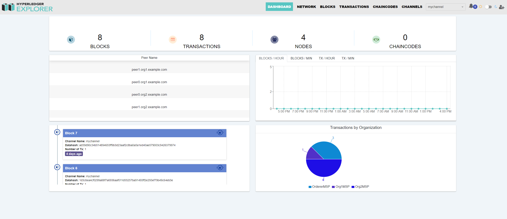

Hyperledger Fabric浏览器搭建
================================
关于fabric explorer区块链浏览器搭建可以参考官方文档

[https://github.com/hyperledger/blockchain-explorer](https://github.com/hyperledger/blockchain-explorer)

而本文会基于官方文档进行安装部署，并就安装过程中遇到的坑列出来，供大家参考！

### Hyperledger Fabric浏览器效果图

 首先看一下效果图

 

 
 

