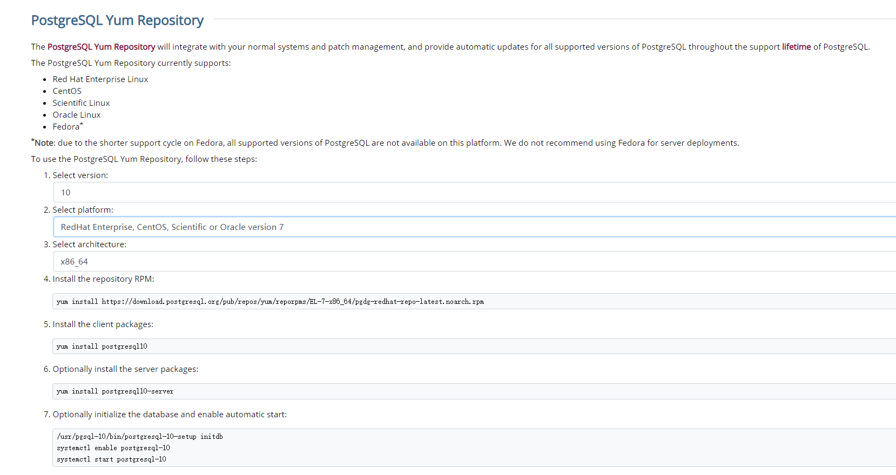
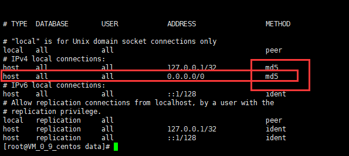
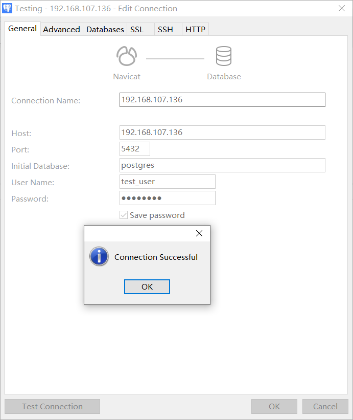
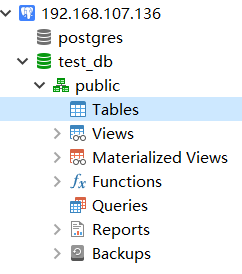

CentOS安装PostgreSQL
==================================================


版本信息：
- CentOS版本：CentOS-7-x86_64-Minimal-1810
- PostgreSQL版本： PostgreSQL 10.10, 64-bit

### PostgresSQL的安装
1、安装rpm文件
```bash
yum install https://download.postgresql.org/pub/repos/yum/reporpms/EL-7-x86_64/pgdg-redhat-repo-latest.noarch.rpm
```

2、安装客户端

```bash
yum install postgresql10
```
3、安装服务端
```bash
yum install postgresql10-server
```


4、初始化
```bash
/usr/pgsql-10/bin/postgresql-10-setup initdb
```


5、设置自动启动并且启动postgresql服务
```bash
systemctl enable postgresql-10

systemctl start postgresql-10
```


postgresql的安装比较简单，[官网](https://www.postgresql.org/download/linux/redhat/)上有明确的操作步骤

<div align=center>


</div>

### 创建用户和数据库
1、使用postgres用户登录（PostgresSQL安装后会自动创建postgres用户，无密码）
```bash
su - postgres
```
<div align=left>


</div>
2、登录postgresql数据库

<div align=left>


</div>
3、创建用户和数据库并授权

```bash
create user test_user with password 'abc123';            // 创建用户
create database test_db owner test_user;                 // 创建数据库
grant all privileges on database test_db to test_user;   // 授权
```
4、退出psql（输入 \q 再按回车键即可）
```bash
\q
```
<div align=left>


</div>

### 开启远程访问
1、修改/var/lib/pgsql/10/data/postgresql.conf文件，取消 listen_addresses 的注释，将参数值改为 *

2、修改/var/lib/pgsql/10/data/pg_hba.conf文件，增加下图红框部分内容,并将ident改为md5


 <div align=left>

 
 </div>

3、切换到root用户，重启postgresql服务

```bash
systemctl restart postgresql-10.service
```
4、使用数据库连接工具测试连接

 <div align=left>

 


 
 </div>


### 补充
1、修改默认生成的 postgres 用户密码（此postgres非上面的postgres用户，此为数据库的用户，上面的为操作系统的用户）
```bash
su - postgres
psql -U postgres
alter user postgres with encrypted password '1';
```
<div align=left>


</div>

2、服务启动、关闭、重启、查看状态命令

```bash
systemctl start postgresql-10.service     // 启动服务
systemctl stop postgresql-10.service      // 关闭服务
systemctl restart postgresql-10.service   // 重启服务
systemctl status postgresql-10.service    // 查看状态
```
